# 🚀 DevOps AWS Assignment

> **Production-like deployment of a Node.js application on AWS using EC2, GitHub Actions, Amazon S3, CloudWatch, IAM, PM2, Nginx and k6.**

---

## 📖 Project Overview

This project demonstrates a complete DevOps workflow by deploying a simple Node.js web application on an AWS EC2 instance. The deployment is fully automated using **GitHub Actions**, monitored using **Amazon CloudWatch**, backed up automatically to **Amazon S3**, and managed securely using **IAM Roles**.

The objective was to build a production-like environment using only AWS Free Tier services while following DevOps best practices.

---

# 🏗️ Architecture

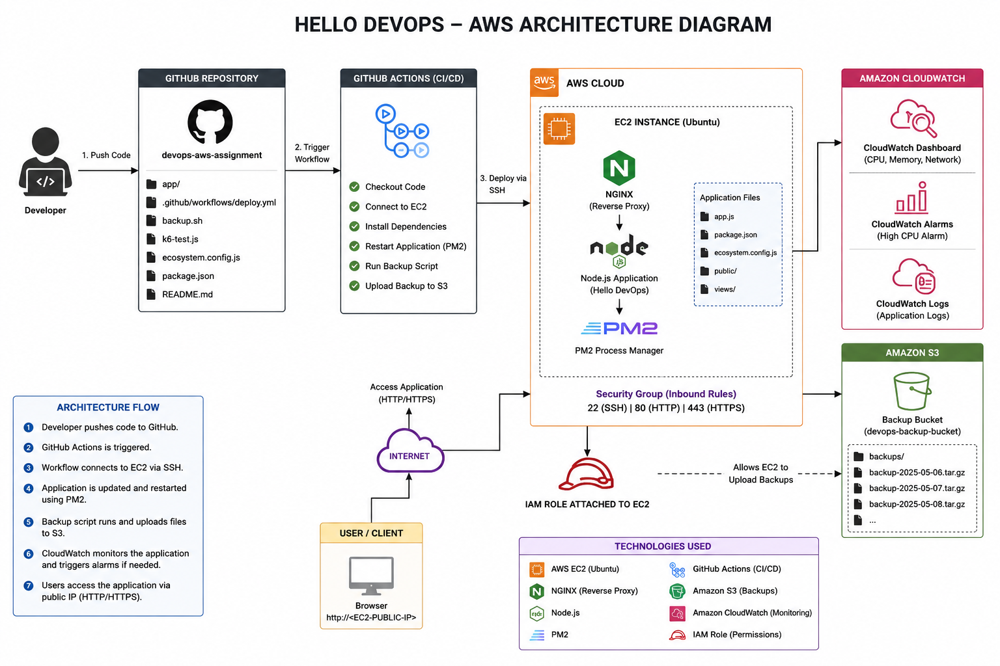

### Architecture Flow

```text
Developer
    │
    ▼
GitHub Repository
    │
    ▼
GitHub Actions (CI/CD)
    │
    ▼
AWS EC2 (Ubuntu)
 ├── Nginx
 ├── Node.js Application
 └── PM2
    │
    ├────────► Amazon CloudWatch
    │           • Dashboard
    │           • Alarms
    │           • Monitoring
    │
    └────────► Amazon S3
                • Automatic Backups
```

---

# ⚙️ Technologies Used

| Technology | Purpose |
|------------|---------|
| ☁️ AWS EC2 | Host the application |
| 📦 Amazon S3 | Automatic backups |
| 📊 Amazon CloudWatch | Monitoring & alarms |
| 🔐 IAM | Secure AWS permissions |
| 🚀 GitHub Actions | CI/CD pipeline |
| 🟢 Node.js | Backend application |
| ⚡ PM2 | Process manager |
| 🌐 Nginx | Reverse proxy |
| 🧪 k6 | Load testing |
| 📝 Git | Version control |

---

# 📂 Project Structure

```text
devops-aws-assignment/
│
├── app/
│   ├── app.js
│   ├── package.json
│   ├── ecosystem.config.js
│   ├── public/
│   └── views/
│
├── .github/
│   └── workflows/
│       └── deploy.yml
│
├── images/
│   ├── architecture.png
│   ├── ec2-instance.png
│   ├── security-group.png
│   ├── website.png
│   ├── github-actions.png
│   ├── github-actions-details.png
│   ├── iam-role.png
│   ├── iam-role-attached.png
│   ├── s3-backup.png
│   ├── cloudwatch-dashboard.png
│   ├── cloudwatch-alarm.png
│   ├── pm2-logs.png
│   └── k6-results.png
│
├── backup.sh
├── k6-test.js
├── README.md
├── SECURITY.md
└── architecture.png
```

---

# ✨ Features

- ✅ Automated CI/CD deployment
- ✅ Node.js application hosted on EC2
- ✅ Process management using PM2
- ✅ Reverse proxy with Nginx
- ✅ Automatic backup to Amazon S3
- ✅ IAM Role based authentication
- ✅ CloudWatch Dashboard
- ✅ CloudWatch Alarm
- ✅ Application logging
- ✅ Load testing using k6
- ✅ Secure Security Group configuration

---

# 🚀 Deployment Workflow

1. Developer pushes code to GitHub.
2. GitHub Actions workflow starts automatically.
3. Workflow connects to EC2 using SSH.
4. Latest code is downloaded.
5. Dependencies are installed.
6. PM2 restarts the application.
7. Backup script runs automatically.
8. Backup is uploaded to Amazon S3.
9. CloudWatch monitors the server continuously.

---

# 🖥️ AWS EC2 Deployment

The application is deployed on an Ubuntu EC2 instance.

### EC2 Instance

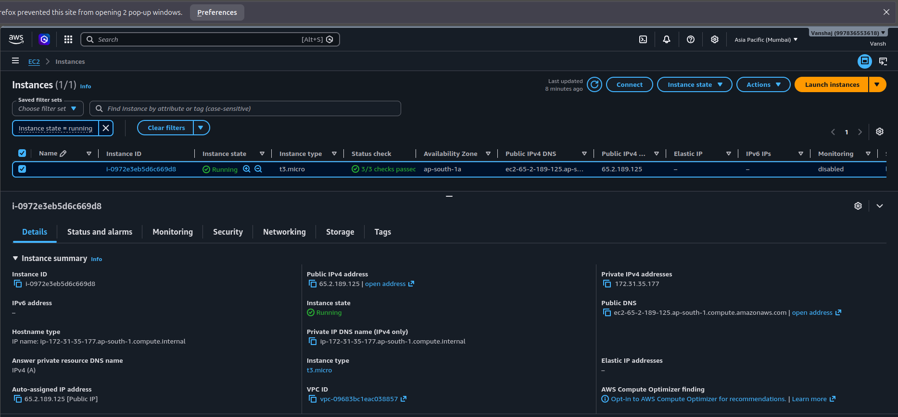

---

# 🔒 Security Configuration

The EC2 instance is protected using AWS Security Groups.

Allowed inbound rules:

- SSH (22)
- HTTP (80)
- HTTPS (443)

### Security Group

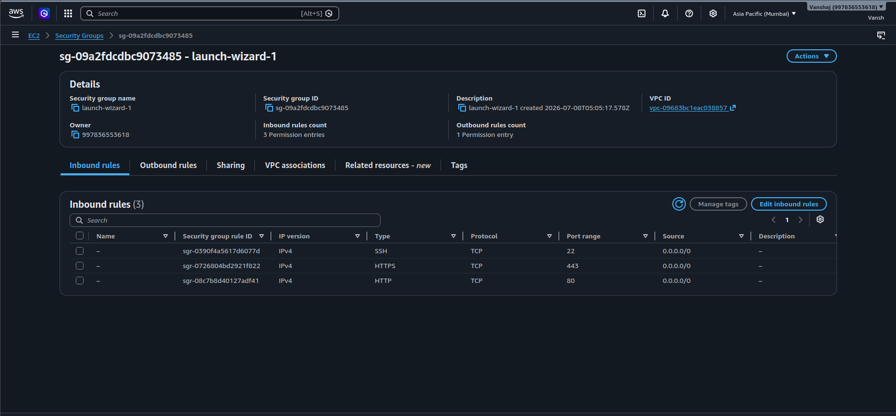

---

# 🔐 IAM Role

The EC2 instance uses an IAM Role to securely access Amazon S3 without storing AWS credentials.

### IAM Role

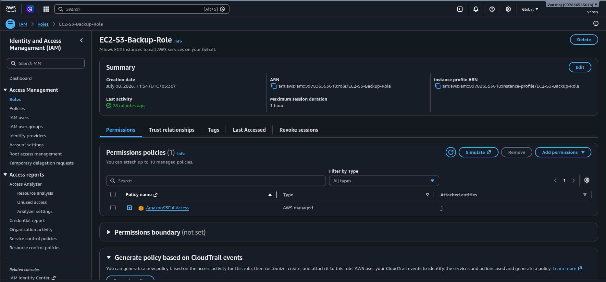

### IAM Role Attached to EC2

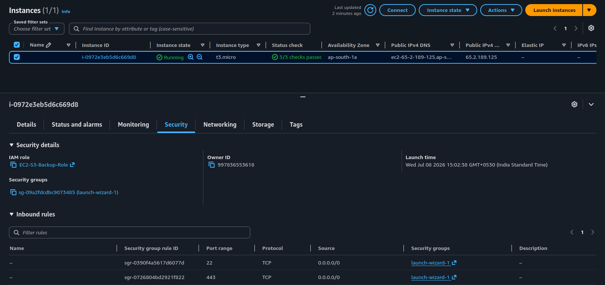

---

# 🌍 Application

The application is publicly accessible through the EC2 Public IP.

### Website

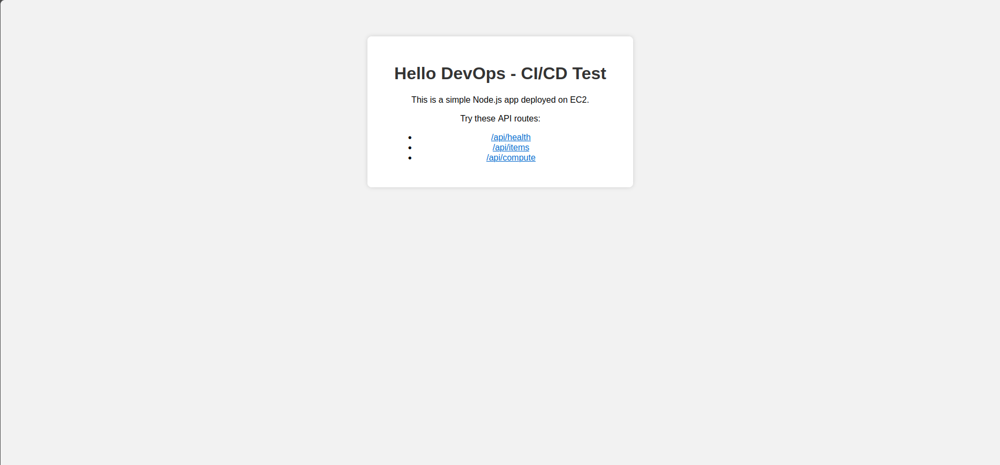

---

# 🚀 CI/CD Pipeline

Deployment is fully automated using GitHub Actions.

Workflow Steps:

- Checkout repository
- Connect to EC2
- Pull latest code
- Install dependencies
- Restart PM2
- Execute backup script
- Upload backup to Amazon S3

### Successful Deployment

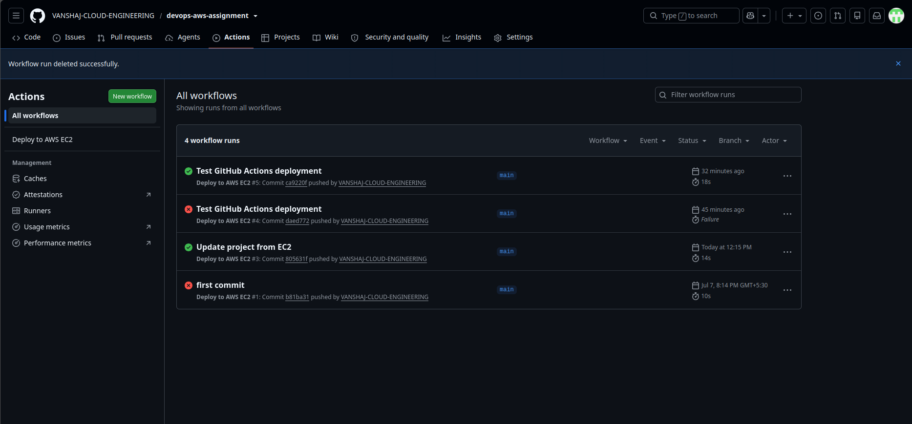

### Workflow Details

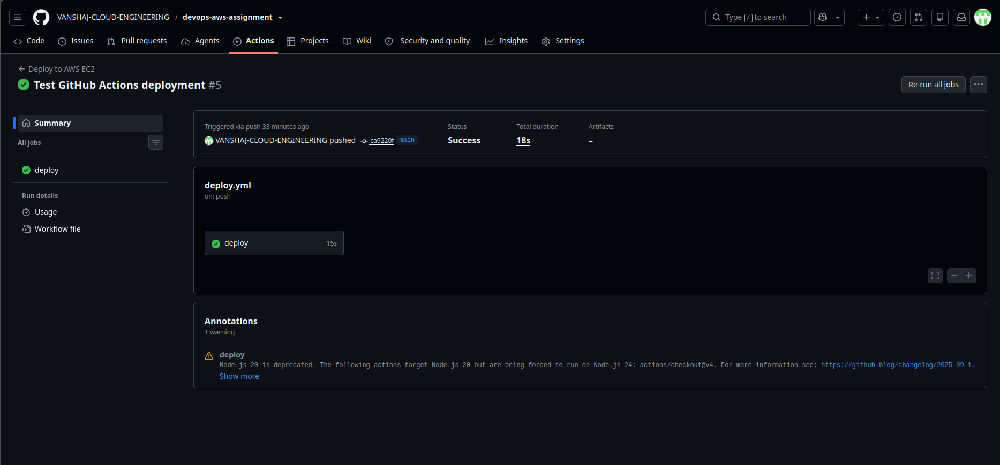

---

# 📦 Amazon S3 Backup

Every successful deployment automatically creates a compressed backup and uploads it to Amazon S3.

### Backup Bucket

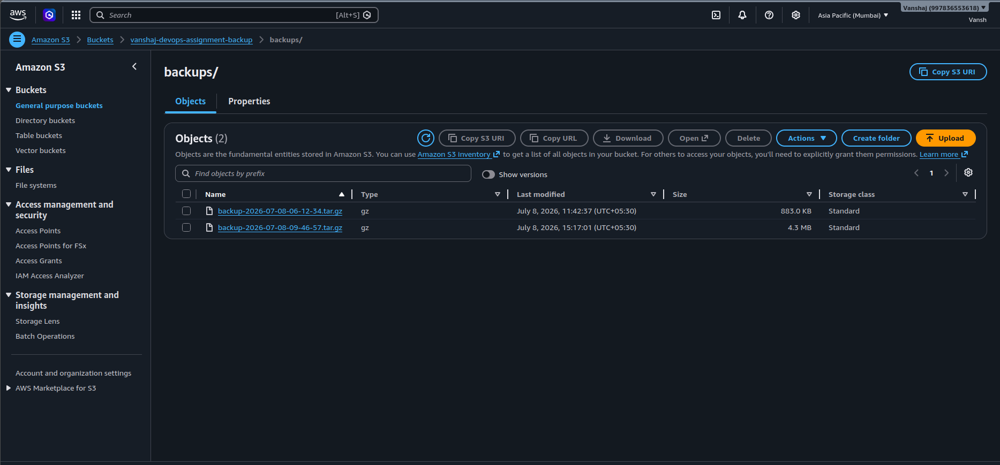

---

# 📊 Monitoring

Amazon CloudWatch is used to monitor the EC2 instance.

It tracks:

- CPU Utilization
- System Health
- Performance Metrics

### Dashboard

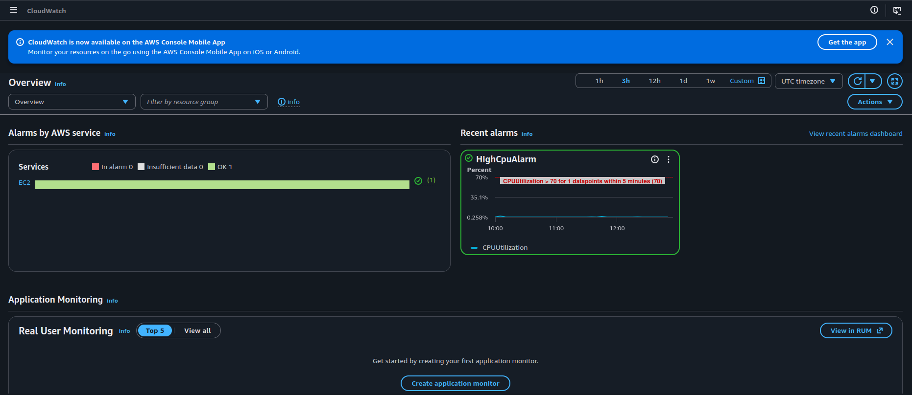

---

# 🚨 CloudWatch Alarm

An alarm is configured to notify when CPU usage becomes high.

### Alarm

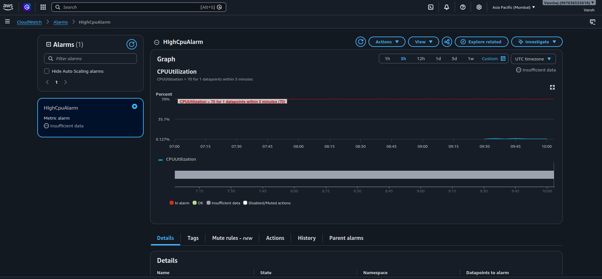

---

# 📝 Application Logs

Application logs are collected using PM2.

### Logs

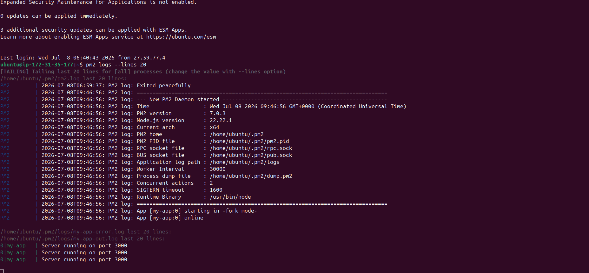

---

# 🧪 Load Testing

Load testing was performed using **k6**.

Command:

```bash
k6 run k6-test.js
```

Metrics measured:

- Response Time
- Throughput
- Error Rate
- Total Requests

### Load Test Result

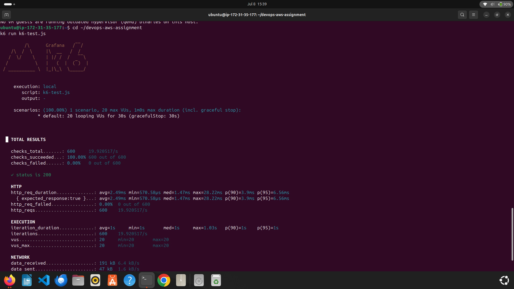

---

# 📋 Performance Summary

The application performed successfully during testing.

- ✅ Stable deployment
- ✅ No application crashes
- ✅ Low response time
- ✅ Zero request failures
- ✅ Automatic deployment successful
- ✅ Automatic S3 backup successful
- ✅ CloudWatch monitoring active

---

# ▶️ Running Locally

Clone the repository

```bash
git clone https://github.com/VANSHAJ-CLOUD-ENGINEERING/devops-aws-assignment.git
```

Go to the project

```bash
cd devops-aws-assignment/app
```

Install dependencies

```bash
npm install
```

Start the application

```bash
npm start
```

Open your browser

```
http://localhost:3000
```

---

# 🔮 Future Improvements

- HTTPS using SSL certificates
- Custom Domain Name
- Auto Scaling Group
- Application Load Balancer
- Docker Containerization
- Kubernetes Deployment
- Terraform Infrastructure as Code
- CloudWatch Logs integration
- AWS CodeDeploy

# 🎥 Project Demo Video

A complete walkthrough of the project is available here:

**Google Drive:**  
https://drive.google.com/drive/folders/1SvJgrKvj0Ae2lifT99Ek8JIXPbT3nzu4

The demo covers:
- Project overview
- GitHub repository structure
- AWS EC2 deployment
- GitHub Actions CI/CD
- Amazon S3 automated backups
- CloudWatch monitoring and alarms
- PM2 process management
- k6 load testing
- Architecture explanation
---

# 👨‍💻 Author

**Vanshaj Rawat**

DevOps AWS Assignment

---

## ⭐ Thank You
